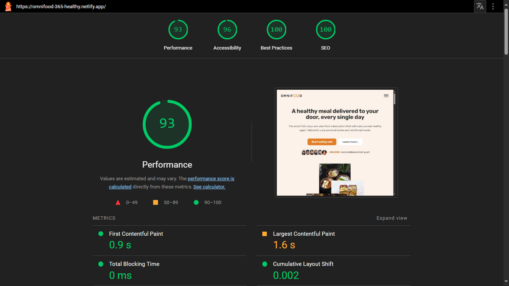
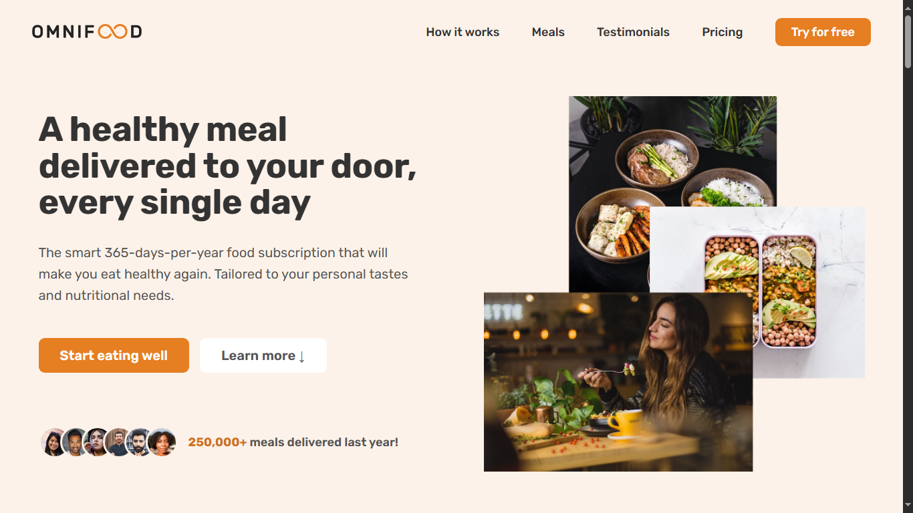

# 🍽️ Omnifood - A Smart Food Subscription Website

Omnifood is a single-page, fully responsive restaurant website built using **HTML**, **CSS**, and modern web development practices.It showcases a smart 365-days-per-year food subscription service that delivers healthy, personalized meals right to your door.
## 📖 Project Overview

This project features a static website that is fast, responsive, and optimized for SEO. It includes a modern, user-friendly interface with flexible layouts created using **Flexbox** and **Grid**, smooth animations powered by **Intersection Observer**, and optimized images for quick loading. It is designed to work seamlessly across all browsers and devices.

Key highlights include a responsive navigation bar with a hamburger menu on smaller screens, a strong focus on accessibility and best practices, and a user-friendly feedback form to enhance user interaction with the service.

## 📈 Lighthouse Report

The Omnifood website has been tested using Google's Lighthouse tool to ensure optimal performance, accessibility, and SEO. Below are the scores:

- **Performance**: 93
- **Accessibility**: 96
- **Best Practices**: 100
- **SEO**: 100

### Screenshot of Lighthouse Report:

## ✨ Features

- **365-days-per-year meal delivery**: Omnifood delivers meals every day of the year, including holidays.  
- **Local and organic ingredients**: All meals are prepared using fresh, local, and organic ingredients.  
- **Sustainable packaging**: All meals are delivered in reusable containers to minimize waste.  
- **Pause subscription anytime**: Users can pause their subscription at any time and receive a refund for unused days.    
- **Responsive navigation**: A fully responsive navigation bar that adapts to screen size, turning into a hamburger menu on smaller screens with smooth animations.  
- **Cross-browser compatibility**: Supports all major web browsers, ensuring a consistent experience for all users.  
- **Image optimization**: All images are optimized for faster page load times, improving performance and user engagement.  
- **User feedback form**: The website includes a feedback form for users to submit their comments, improving interactivity.  
- **Error handling**: All user inputs are validated, and any errors (such as invalid input) are displayed as friendly error messages. 

## 💻 Technologies Used

- **HTML**: Markup language used to structure the website's content.  
- **CSS**: Stylesheet language used to style the website, including layout, typography, and colors.  
- **Flexbox**: Utilized for creating flexible and responsive layouts.  
- **Grid**: Employed for designing the layout structure in a modern and responsive way.  
- **Intersection Observer**: Used for smooth animations triggered by scroll events.  
- **Responsive Design**: Ensures the website works flawlessly across all screen sizes and devices.  
- **Image Optimization**: Optimized images for faster loading times and better performance.  
- **SEO Best Practices**: Meta tags and clean code implemented for improved search engine visibility.  
- **Accessibility**: High contrast colors and semantic HTML elements to ensure the website is accessible to all users.  

### 📚 Key Learnings & Challenges

- **Balancing performance and design**: Ensured fast load times without compromising on a modern, smooth design.
- **Image optimization**: Reduced file sizes to improve load speed while maintaining visual quality.
- **Accessibility improvements**: Carefully selected color contrasts and used semantic HTML, leading to a 96/100 Lighthouse accessibility score.
- **Handling responsiveness**: Implemented flexible layouts with **Flexbox** and **Grid** for a seamless experience across all devices.
- **Cross-browser compatibility**: Ensured the website works consistently across all major browsers.

### 🌐 SEO Optimization

- **Meta tags**: Added descriptive meta tags to improve search engine visibility.
- **Alt attributes**: Used detailed alt text for images to enhance SEO and accessibility.
- **Optimized page speed**: Minimized render-blocking resources and optimized images for faster loading times.
- **Semantic HTML**: Structured the website with clean, semantic code to improve indexability by search engines.
- **Lighthouse SEO score**: Achieved a perfect SEO score of 100 using best practices.

## 💡 How to Use

1. **Open `index.html`**: Simply open the `index.html` file in your browser. No additional setup or installation is required.
2. **Explore the site**: Navigate through various sections of the website using the responsive navigation menu.
3. **Try the form**: Use the feedback form to enter your details and interact with the website.
4. **Cross-device testing**: Test the responsiveness by resizing the browser window or opening it on mobile devices.
5. **Error Handling**: Invalid inputs in the form will trigger user-friendly error messages.

## 📸 Screenshots

